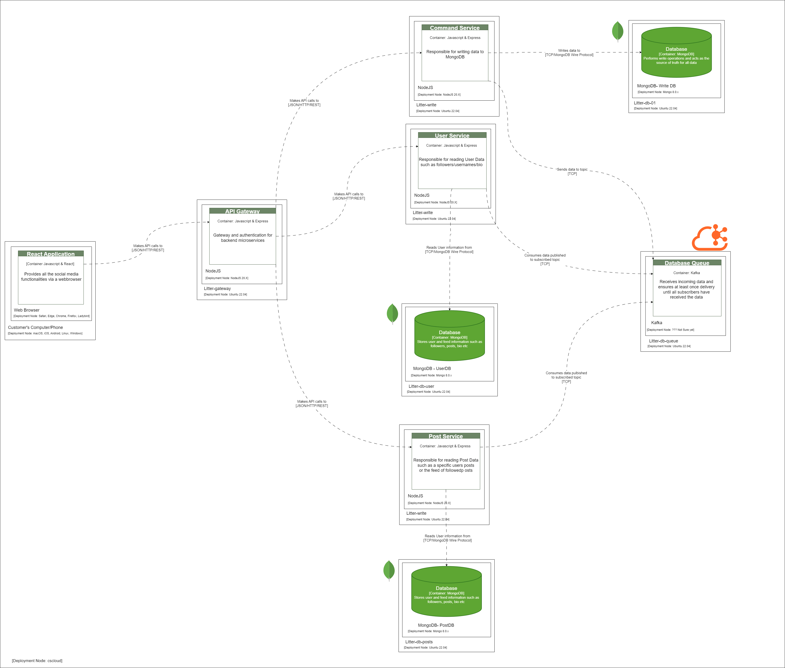

# litter-mono

This is a monorepo for litter, a micro-blog social media app similar to Twitter.

## Project Structure

The project has a microservice architecture as follows. The command service corresponds to the [write-service](./write-service/) in the project.

